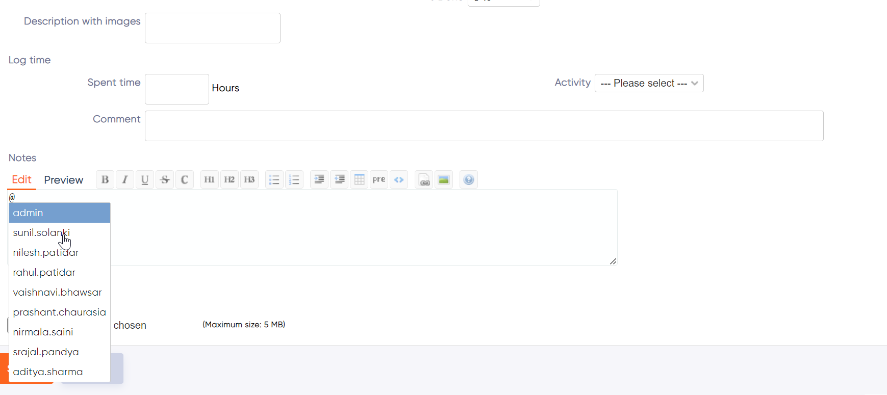
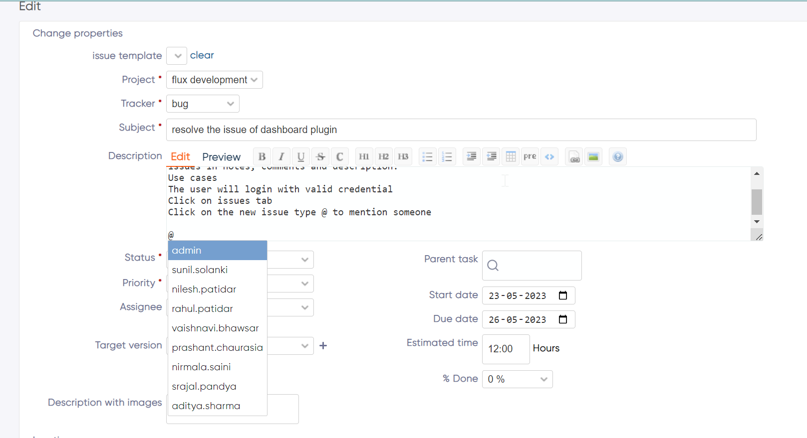
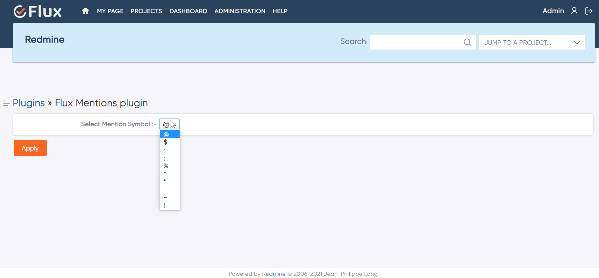

# Redmineflux Mention Plugin

The Redmineflux Mention Plugin is a powerful tool for mentioning users in Redmine, enabling better collaboration and communication among team members. This plugin allows users to mention others within issue descriptions ,issue notes and wiki-content, and provides notification emails to the mentioned users.










## installation:-

To install the redmineflux Mention Plugin , follow these steps:

1. Make sure you have a working installation of Redmine 

2. clone the codecommit repository using your credentials in Redmine plugins directory
   ```sh
   git clone https://git-codecommit.ap-south-1.amazonaws.com/v1/repos/flux_mentions
   ``` 

3. Run the following command to install the required dependencies:
    ```sh
    bundle install 
    ```

4. Run DB migrations 
    * For production 
    ```sh
    RAILS_ENV=production bundle exec rails redmine:plugins:migrate 
    ```
    * For development 
    ```sh
    RAILS_ENV=development bundle exec rails redmine:plugins:migrate
    ``` 

5. Restart Redmine server to load the plugin 
    ```sh
    Rails s 
    ```

6. Log in to Redmine as an administrator.

7. Navigate to the Administration area.

8. Select "Plugins" from the sidebar menu.

9. Locate the Flux Mention Plugin and click on "Configure."

10. Customize the special symbol according to your preferences.

11. Save the configuration changes.


Troubleshoot for bundle intall and startup problem
This plugin repository includes some test code and gem settings. If you have some troubles related to bundle install, please try --without option.
```sh
bundle install --without test
```


## Features for Redmineflux Mention Plugin:-

 The Redmineflux Mention Plugin provides serveral features and visualize effectively. Here the main features:

 * ### Special Symbol Configuration:
 This plugin allows the customization of the special symbol used for mentioning users. The symbol can be changed in the configuration settings, and only managers and administrators have the ability to modify it.

 * ### User Mention in Description and Notes
 With this plugin, users can easily mention other users within the issue description and notes fields. By typing the special symbol followed by the username, a list of users from the particular project will be displayed, making it convenient to select the intended recipient.

 * ### Notification Emails
 The Flux Mention Plugin provides notification emails to the mentioned users. When a user is mentioned in an issue, they will receive an email notification, ensuring that they stay informed and can quickly respond to relevant discussions.

* ### Mention Users in Wiki Pages:
 The plugin allows users to mention other users within Redmine wiki pages. This feature enhances collaboration and communication by enabling users to reference and involve specific individuals in wiki content.

* ### User-Friendly Interface: 
 The Flux Mention Plugin is designed with a user-friendly interface, ensuring ease of use for all Redmine users. The mention functionality is seamlessly integrated into the issue description, notes, and wiki pages, providing a smooth and intuitive experience.

* ### User Filtering: 
 When mentioning users, the plugin displays a filtered list of users specific to the current project. This feature ensures that only users relevant to the project are included in the mention list, reducing clutter and improving efficiency.

## Uninstallation  

To uninstall the Redmineflux Mention Plugin, follow these steps: 
   - Go to the Redmineflux Mention Plugin directory in Redmine. 
   - Delete the entire Redmineflux Mention directory from Redmine/plugins directory. This step removes the plugin files from your Redmine installation. 
   - If the plugin required a migration, run the following command to downgrade your database (make a db backup before) 

    ```sh
        Bundle exec rake redmine:plugins:migrate Name=plugin name VERSION=0  RAILS_ENV=production 
    ```

   - Restart the Redmine server to see the changes. 
   - This will uninstall the Redmineflux Mention Plugin from Redmine

## Version Compatibility  

  Redmien Versions 
   - 4.0.x, 4.1.x, 4.2.x 
   - 5.0.x , 5.1.x
   - 6.0.x(coming soon)


## Support and Feedback

If you encounter any issues, have questions, or would like to provide feedback on the Redmineflux Mention Plugin, please reach out to our support team at [Redmineflux](https://www.redmineflux.com) We appreciate your input and will do our best to assist you.

## About
The Flux Mention Plugin is developed and maintained by the Redmineflux Plugins team. To learn more about our other plugins and services, visit our website [zehntech](https://zehntech.com).

